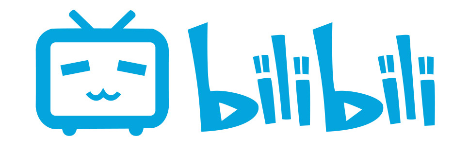
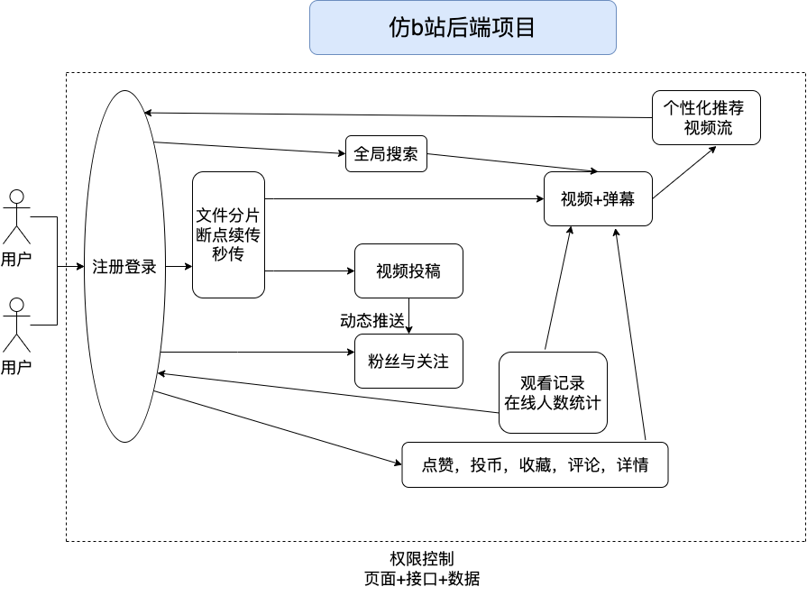
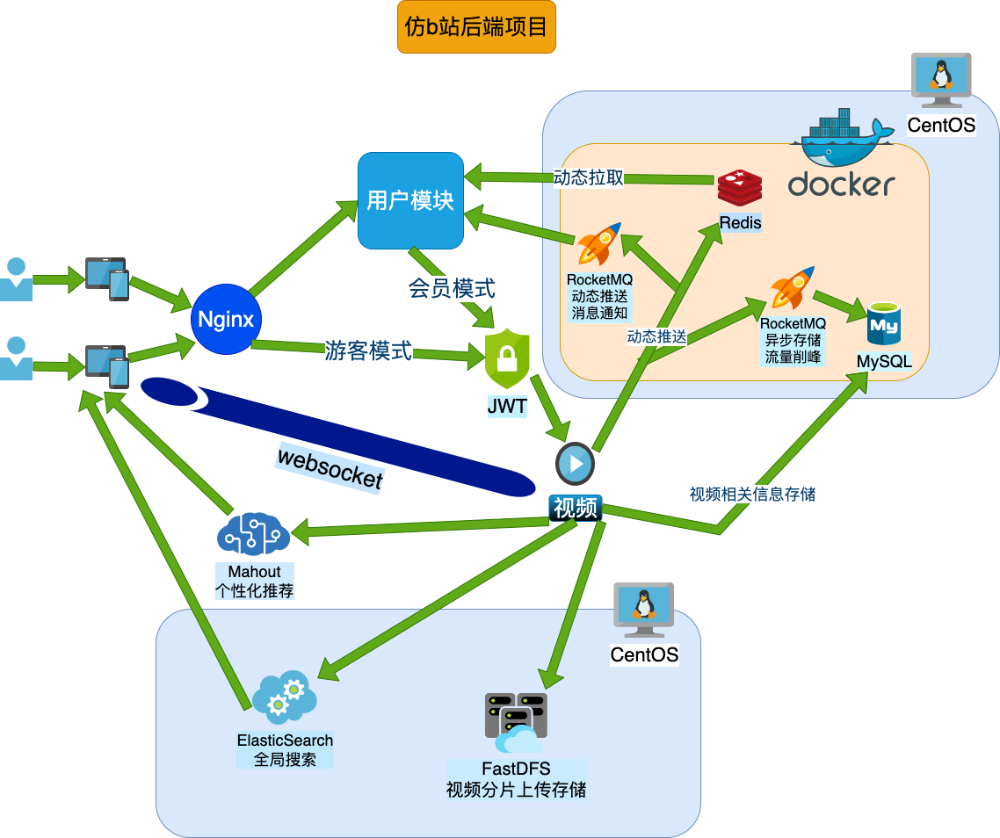

<h1>bilibili(仿)</h1>

<b>基于 Spring Boot 的仿bilibili后端项目</b>

## 项目简介

> 注意⚠️：本项目是一个纯后端项目，没有前端页面
>
> - 之前发生的b站源码泄漏事件，我表示很遗憾，与此同时很多仿b站架构的项目如雨后春笋，甚至还掀起了一股学习go语言的热潮，也称得上是这次事件的少有的积极影响了
>
> **作为中国国内最成功的视频网站之一，b站的网站架构，功能模块的划分，以及各种“特色功能”（弹幕系统等）非常值得学习**

我作为一名个人开发者，我用自己的技术试图复现b站的后端系统，这里我也暂时将项目叫做“bilibili”

**’bilibili‘是一个开源的后端项目，任何企业和个人可以免费学习使用**

- 本项目实现了哔哩哔哩大部分核心功能：**用户（权限）**，**视频**，**弹幕**，**视频流（个性化推荐）**等
- 用户模块运用**三种算法**（RSA，MD5，AES）实现 **JWT-Token** 登录
- 将登录模式进一步改造成**双令牌登录（RefreshToken）**，实现**自动刷新Token**，大大提升了用户体验
- 使用**自定义注解**以及**数据库表设计（用户表，权限表，角色表，关联表）**，设计了一套**可拓展的权限体系**，实现页面，接口，数据等层面的**精细化权限控制**
- 使用**Redis缓存**动态相关信息，提升了**动态列表以及视频流的响应速度**与实时性，降低数据库压力
- 使用FastDFS搭建分布式文件系统，将**视频分片**后上传下载，降低了因网络波动导致出错的概率
- 使用RocketMQ实现**动态消息异步推送**，**视频文件信息异步存储**，提升了动态发送，视频上传的速度
- 使用ElasticSearch实现**全文检索并且高亮搜索字段**，让用户拥有良好的搜索体验
- 使用**Mahout推荐算法**量化用户行为，根据用户喜好进行**个性化推荐**
- 使用**WebSocket**实现长连接，**发送实时弹幕**，进行**在线观看人数统计**

- 采用前后端分离的开发模式，项目目前只有后端
- 为了便于开发，这里从文件系统上分为了dao，service，api三个模块，并没有完全按照功能划分
- 因为是个人开发，考虑到不会有很大流量，这里暂时没有使用分布式微服务
- 会持续改进，后续可能考虑上线

## 项目架构图

### 业务架构图

### 技术架构图

## 项目用到的技术

- Java 1.8
- Spring Boot 2.x
- MyBatis (Plus)
- MySQL
- Redis
- ElasticSearch
- RocketMQ
- FastDFS
- JWT
- Mahout
- FastJson

## 项目模块说明

- `bilibili-api`：项目核心模块，提供项目对外API接口以及权限校验
- `bilibili-service`：提供各种配置类以及工具类，拦截器等，提供服务接口（Interface）及其实现类
- `bilibili-dao`：提供实体类对象，Repository，mapper，自定义异常，常量，自定义注解

## 如何使用本项目

在使用本项目前，请在MySQL中**新建‘bilibili’数据库**，然后执行sql文件夹下的sql文件，**生成对应的表**

- **方法一：**

下载源码，导入Idea，配置运行`bilibili-api`模块下的`BilibiliApp`即可

> 注意：因为隐藏了配置文件，所以需要修改各个模块下的application.yml配置文件才可以正常启动

- **方法二：**

使用`java -jar` 命令运行`bilibili-api`模块下的 `bilibili-api-1.0-SNAPSHOT.jar` 即可

